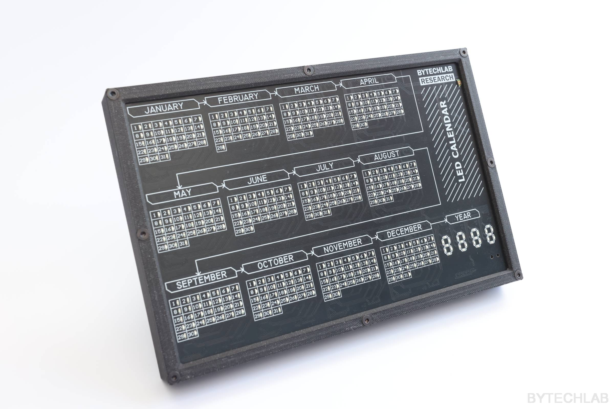

    

  
  
<h3 align="center">LED CALENDAR</h3>

<!-- ABOUT THE PROJECT -->
## About The Project

    

Led calendar project .........

Project category: [DIGITAL_EL]

(<a href="#readme-top">back to top</a>)

## Built With

- Altium Designer,
- Autodesk Inventor,
- Arduino ( libraries.....)

(<a href="#readme-top">back to top</a>)

## TODO

- [x] Fix bugs...
- [x] Fix bugs...
- [ ] Fix bugs...
    - [ ] Fix bugs...

(<a href="#readme-top">back to top</a>)

## MCAD - REV1 - Bugs

.............

(<a href="#readme-top">back to top</a>)

## ECAD - REV1 - Bugs

.............

(<a href="#readme-top">back to top</a>)

## License
Software \ Firmware:

Hardware:

[![CC BY-NC-SA 4.0][cc-by-nc-sa-shield]][cc-by-nc-sa]

[Creative Commons Attribution-NonCommercial-ShareAlike 4.0 International License][cc-by-nc-sa].

[![CC BY-NC-SA 4.0][cc-by-nc-sa-image]][cc-by-nc-sa]

[cc-by-nc-sa]: http://creativecommons.org/licenses/by-nc-sa/4.0/
[cc-by-nc-sa-image]: https://licensebuttons.net/l/by-nc-sa/4.0/88x31.png
[cc-by-nc-sa-shield]: https://img.shields.io/badge/License-CC%20BY--NC--SA%204.0-lightgrey.svg

(<a href="#readme-top">back to top</a>)

## Links

ByTechLab project link:   .........

(<a href="#readme-top">back to top</a>)

